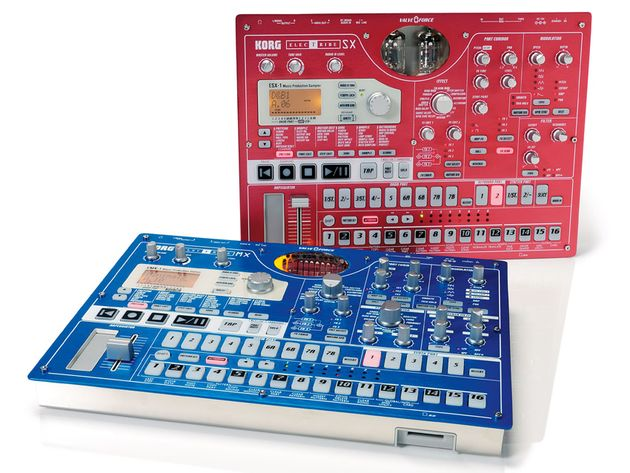

Electribe reverse engineering
=============================

A gitrepo which represents people's attempts to document our research of 
the inner workings of the electribe emx/esx.
All the firmware files are here for anyone to play with.

# Why 

Korg has not released any firmware, and released new korg electribes.
It is fair to say that Korg abandoned the EMX/ESX machines.
Actually I am by no means an reverse engineer, however nothing is documented
either so here's a beginning.
Reverse engineering can be a complete (fun) waste of time, but not impossible
(think the [typhoon OS](http://en.wikipedia.org/wiki/Typhoon_2000) )

# Specs

* power: AC9V adaptor 3000ma 
* 16 bit -> ESX/EMX processor: hitachi SH-3 7709S
* 16 bit -> DSP chip: uPD77213, 120 mhz, 32x16bit rom, 18x16bit ram
* 16 bit -> SRAM 2Mbit (256k x 16bit) 
* uses SH77095 32 bit SDRAM memory: max 512Mbit = 256Mbit(x16) x2 for patterns, song,global,work,midi
* 32bit -> ESX SDRAM: 128Mbit, (8Mx16) x2 
* 32bit -> EMX SDRAM: 64Mbit, (4Mx16) x2 
* LCD: NJU6468 
* 8 bit -> boot flash chip: 4MB Flash, 8 bit (IC15 see page 2 on service manual)
* 8 bit -> Nan Flash USER BACKUP (EMX: 128Mbit) (ESX: 256Mbit) (probably storage settings when power on/off)
* 8 bit -> smartmedia user backup (4MB till 128MB)

for more see the [service manual](doc/EMX_ESX_Service_Manual.pdf)

# Factory reset:

To restoring the factory settings of Korg Electribe ESX-1 SD/ EMX-1 SD, you must power on while simultaneously holding the Transpose/Solo and write buttons. When the displa appears “Init, are you sure?”, press Play button. The Factory Reset procedure is complete.

Warning! This procedure will returning all of the settings to the values when the ESX-1 SD/ EMX-1 SD was shipped from the factory. Be sure that you want to do this :)

# Internal test mode:  

How to start and operate the test mode:

    ERASE + PATTERN & POWER ON: Internal test,
    ERASE + STEP EDIT & POWER ON: Adjustment of valve circuit, L/R balance
    calibration, Tube gain balance measurement
    SHIFT + DRUM PART 1 & POWER ON: Internal skip
    SHIFT + DRUM PART 3 & POWER ON: Audio test
    16:
    Proceed the test
    SHIFT + 15: Re-executing the test
    : ITEM UP
    : ITEM DOWN
    >> : STEP UP
    << : STEP DOWN
    NOTE:
    To proceed the SmartMedia test, it is required to prepare a SmartMedia whose capacity
    is more than 16MB.

for more info see the [service manual](doc/EMX_ESX_Service_Manual.pdf)

# Questions/Roadmap:

Following questions are controversial and will eventually break somebody's electribe:

* Is it worth it at all? :D
* why does the service manual specify 
* can the memory be upgraded, and would the OS still work.
* can a bricked electribe be overwritten/restored with the original flash?
* can somebody learn something from the JTAG connector on the PCB?
* what does the EMX/ESX setting on the PCB board do (indicates control surface?)
* what modifications are needed in order to succesfully flash an ESX with EMX firmware (and vice versa)
* what is the ROM ICE chip on page 1 of the service manual

# Tools used so far: 

* binwalk
* hexdump
* hexdiff 
* vim

# The suspects:

    $ ls -la
    total 6.5M
    drwxr-xr-x 2 leon leon 4.0K Oct  5 18:31 .
    drwxr-xr-x 4 leon leon 4.0K Oct  5 17:55 ..
    -rw-rw-rw- 1 leon leon 512K Oct 16  2003 ESX0101F.BFS
    -rw-rw-rw- 1 leon leon 960K Nov 17  2003 ESX0102D.BDS
    -rw-rw-rw- 1 leon leon 2.0M Feb 27  2004 ESX0102N.BSS
    -rw-rw-rw- 1 leon leon  73K May  5  2004 ESX_102_History.pdf
    -rw-rw-rw- 1 leon leon  84K May  5  2004 ESX_102_HowTo.pdf
    -rw-rw-rw- 1 leon leon 2.9M Feb 26  2004 ESX1_V101Addendum.pdf
    -rw-r--r-- 1 leon leon    0 Oct  5 18:32 research.txt

# ESX: hexdump ESX0101F.BFS

    00000000  4b 4f 52 47 00 00 00 71  42 46 53 20 30 31 30 31  |KORG...qBFS 0101|
    00000010  30 30 30 30 00 00 00 00  00 00 00 00 00 00 00 00  |0000............|
    00000020  a0 06 00 09 00 09 00 09  00 09 00 09 00 09 00 09  |................|
    00000030  d0 20 91 5f 20 11 d0 20  91 5d 20 11 d0 1c 91 61  |. ._ .. .] ....a|
    00000040  20 11 d0 1d 91 58 20 11  d0 1c 91 5c 20 11 d0 1c  | ....X ....\ ...|
    00000050  91 5a 20 11 d0 1b 91 58  20 11 d0 1b 91 56 20 11  |.Z ....X ....V .|
    00000060  d0 1b 91 56 20 11 d0 1d  91 55 20 11 d0 1e 61 01  |...V ....U ...a.|
    00000070  92 3c 21 29 92 3b 21 2b  20 11 91 49 d0 1c 60 00  |.<!).;!+ ..I..`.|
    00000080  c8 10 8b 00 91 43 d0 11  20 11 d0 12 91 42 20 11  |.....C.. ....B .|

Q: some kind of proprietary filesystem image?

# ESX: Identifying the firmware files:

    $ binwalk ESX0101F.BFS ESX0102D.BDS ESX0102N.BSS

    Scan Time:     2014-10-05 18:32:28
    Target File:   ESX0101F.BFS
    MD5 Checksum:  a493dd6561a8319170470ea34e1e27a1
    Signatures:    302

    DECIMAL       HEXADECIMAL     DESCRIPTION
    --------------------------------------------------------------------------------
    154221        0x25A6D         LZMA compressed data, properties: 0x6E, dictionary size: 65536 bytes, uncompressed size: 544104784 bytes
    154349        0x25AED         LZMA compressed data, properties: 0x6E, dictionary size: 65536 bytes, uncompressed size: 544104784 bytes

    Scan Time:     2014-10-05 18:32:28
    Target File:   ESX0102D.BDS
    MD5 Checksum:  6f6077105dfca37689247f8e3b59572f
    Signatures:    302

    DECIMAL       HEXADECIMAL     DESCRIPTION
    --------------------------------------------------------------------------------

    Scan Time:     2014-10-05 18:32:29
    Target File:   ESX0102N.BSS
    MD5 Checksum:  0621cb88d38e0a4179944f14f2ba5a81
    Signatures:    302

    DECIMAL       HEXADECIMAL     DESCRIPTION
    --------------------------------------------------------------------------------

Q: one is a filesystem and the others are .. ?
Q: does every file relate to another chip?

# EMX: Identifying the firmware files:

    $ ls emx/
    total 3.5M
    drwxr-xr-x 2 leon leon 4.0K Oct  5 17:51 .
    drwxr-xr-x 4 leon leon 4.0K Oct  5 19:00 ..
    -rwxr-xr-x 1 leon leon 960K Jul  4  2003 EMX0100D.BDA
    -rwxr-xr-x 1 leon leon 2.0M Feb 27  2004 EMX0102N.BSA
    -rwxr-xr-x 1 leon leon 512K Oct 16  2003 EMX0104F.BFA
    $ cd emx 
    $ binwalk EMX0*
    Scan Time:     2014-10-05 19:08:18
    Target File:   EMX0100D.BDA
    MD5 Checksum:  ce348ebe4a4d8163333d2437988d44e3
    Signatures:    302

    DECIMAL       HEXADECIMAL     DESCRIPTION
    --------------------------------------------------------------------------------

    Scan Time:     2014-10-05 19:08:19
    Target File:   EMX0102N.BSA
    MD5 Checksum:  d70ef53db727090251072e96c09c5067
    Signatures:    302

    DECIMAL       HEXADECIMAL     DESCRIPTION
    --------------------------------------------------------------------------------
    249558        0x3CED6         LZMA compressed data, properties: 0x91, dictionary size: 16777216 bytes, uncompressed size: 230416 bytes
    250198        0x3D156         LZMA compressed data, properties: 0x91, dictionary size: 33554432 bytes, uncompressed size: 230436 bytes

    Scan Time:     2014-10-05 19:08:21
    Target File:   EMX0104F.BFA
    MD5 Checksum:  5667e137a0285d442878e2c3ce19a988
    Signatures:    302

    DECIMAL       HEXADECIMAL     DESCRIPTION
    --------------------------------------------------------------------------------
    154577        0x25BD1         LZMA compressed data, properties: 0x6E, dictionary size: 65536 bytes, uncompressed size: 544104784 bytes
    154705        0x25C51         LZMA compressed data, properties: 0x6E, dictionary size: 65536 bytes, uncompressed size: 544104784 bytes

Q: why does binwalk detect compressed data in 2 files, and the ESX only one?

# ESX/EMX: Failed attempt to extract the LZMA compressed firmware :

    $ apt-get install lzma 
    $ unlzma ESX0101F.BFS
    ESX0101F.BFS:  unknown suffix -- unchanged
    $ tar --lzma -xvf ESX0101F.BFS
    xz: (stdin): File format not recognized
    tar: Child returned status 1
    tar: Error is not recoverable: exiting now

    (same goes for the other ones)

# EMX: Extract file using binwalk -e

    (todo)

# ESX: Extract file using binwalk -e

Try to extract files from firmwarefile: ESX01012D.BDS:

    $ binwalk -Me ESX0102D.BDS
    (doesnt extract anything)

Try to extract files from firmwarefile: ESX0101F.BFS:

    $ binwalk -e ESX0101F
    (this works, 'BFS' probably means B... Filesystem)
    $ ls _ESX0101F.BFS.extracted/
    total 736K
    drwxr-xr-x 2 leon leon 4.0K Oct  5 18:42 .
    drwxr-xr-x 3 leon leon 4.0K Oct  5 18:42 ..
    -rw-r--r-- 1 leon leon 362K Oct  5 18:42 25A6D.7z
    -rw-r--r-- 1 leon leon 362K Oct  5 18:42 25AED.7z

Hex view of 25A6D.7z :

    (25AED.7z is almost identical)

       Visuel HexDiff v 0.0.53 by tTh 2007                             dec   7bits  
           0   6e 00 00 01 00 50 61 6e 20 00 00 00 00 46 78 45    n    Pan     FxE
          16   31 00 00 00 00 4f 73 63 31 00 00 00 00 52 65 73    1    Osc1    Res
          32   6f 00 00 00 00 4c 76 6c 20 00 00 00 00 46 78 45    o    Lvl     FxE
          48   32 00 00 01 00 4f 73 63 32 00 00 00 00 44 72 69    2    Osc2    Dri
          64   76 00 00 00 00 45 67 54 6d 00 00 01 00 44 70 74    v    EgTm    Dpt
          80   68 00 00 01 00 53 6c 69 64 00 00 00 00 43 75 74    h    Slid    Cut
          96   66 00 00 01 00 50 74 63 68 00 00 00 00 53 70 65    f    Ptch    Spe
         112   64 00 00 02 00 52 69 62 6e 00 00 01 00 45 67 49    d    Ribn    EgI
         128   6e 00 00 01 00 50 61 6e 20 00 00 00 00 46 78 45    n    Pan     FxE
         144   31 00 00 00 00 53 74 74 50 00 00 00 00 52 65 73    1    SttP    Res
         160   6f 00 00 00 00 4c 76 6c 20 00 00 00 00 46 78 45    o    Lvl     FxE
         176   32 00 00 00 00 6e 6f 6e 65 00 00 00 00 6e 6f 6e    2    none    non
         192   65 00 00 20 52 45 56 45 52 42 20 00 42 50 4d 20    e   REVERB  BPM
         208   53 59 4e 43 00 53 48 4f 52 54 20 44 4c 00 4d 4f    SYNC SHORT DL MO
         224   44 20 44 45 4c 41 00 47 41 49 4e 20 53 48 46 00    D DELA GAIN SHF 
         240   43 48 4f 2f 46 4c 47 20 00 20 50 48 41 53 45 52    CHO/FLG   PHASER
         256   20 00 52 49 4e 47 20 4d 4f 44 00 54 41 4c 4b 49      RING MOD TALKI
         272   4e 47 20 00 50 49 54 43 48 20 53 48 00 43 4f 4d    NG  PITCH SH COM
         288   50 52 45 53 53 00 44 49 53 54 4f 52 54 49 00 44    PRESS DISTORTI D
         304   45 43 49 4d 41 54 4f 00 20 20 20 45 51 20 20 20    ECIMATO    EQ  

         ^^----- _ESX0101F.BFS.extracted/25A6D.7z 

           0   6e 00 00 01 00 50 61 6e 20 00 00 00 00 46 78 45    n    Pan     FxE
          16   31 00 00 00 00 53 74 74 50 00 00 00 00 52 65 73    1    SttP    Res
          32   6f 00 00 00 00 4c 76 6c 20 00 00 00 00 46 78 45    o    Lvl     FxE
          48   32 00 00 00 00 6e 6f 6e 65 00 00 00 00 6e 6f 6e    2    none    non
          64   65 00 00 20 52 45 56 45 52 42 20 00 42 50 4d 20    e   REVERB  BPM
          80   53 59 4e 43 00 53 48 4f 52 54 20 44 4c 00 4d 4f    SYNC SHORT DL MO
          96   44 20 44 45 4c 41 00 47 41 49 4e 20 53 48 46 00    D DELA GAIN SHF
         112   43 48 4f 2f 46 4c 47 20 00 20 50 48 41 53 45 52    CHO/FLG   PHASER
         128   20 00 52 49 4e 47 20 4d 4f 44 00 54 41 4c 4b 49      RING MOD TALKI
         144   4e 47 20 00 50 49 54 43 48 20 53 48 00 43 4f 4d    NG  PITCH SH COM
         160   50 52 45 53 53 00 44 49 53 54 4f 52 54 49 00 44    PRESS DISTORTI D
         176   45 43 49 4d 41 54 4f 00 20 20 20 45 51 20 20 20    ECIMATO    EQ
         192   00 20 20 4c 50 46 20 20 20 00 20 20 48 50 46 20       LPF      HPF
         208   20 20 00 20 52 45 56 45 52 42 20 00 41 55 44 49        REVERB  AUDI
         224   4f 20 49 4e 00 57 41 56 45 46 4f 52 4d 00 44 55    O IN WAVEFORM DU
         240   41 4c 20 4f 53 43 00 20 43 48 4f 52 44 20 20 00    AL OSC  CHORD
         256   20 55 4e 49 53 4f 4e 20 00 52 49 4e 47 20 4d 4f     UNISON  RING MO
         272   44 00 4f 53 43 20 53 59 4e 43 00 43 52 4f 53 53    D OSC SYNC CROSS
         288   20 4d 4f 00 20 20 56 50 4d 20 20 20 00 20 20 20     MO   VPM
         304   57 53 20 20 20 00 41 44 44 54 49 56 45 20 00 20    WS    ADDTIVE

         ^^----- _ESX0101F.BFS.extracted/25AED.7z 

# ESX: hexdumpin 25A6D.7z

    $ hexdump -s 4 -C _ESX0101F.BFS.extracted/25A6D.7z
    00000004  00 50 61 6e 20 00 00 00  00 46 78 45 31 00 00 00  |.Pan ....FxE1...|
    00000014  00 4f 73 63 31 00 00 00  00 52 65 73 6f 00 00 00  |.Osc1....Reso...|
    00000024  00 4c 76 6c 20 00 00 00  00 46 78 45 32 00 00 01  |.Lvl ....FxE2...|
    00000034  00 4f 73 63 32 00 00 00  00 44 72 69 76 00 00 00  |.Osc2....Driv...|
    00000044  00 45 67 54 6d 00 00 01  00 44 70 74 68 00 00 01  |.EgTm....Dpth...|
    00000054  00 53 6c 69 64 00 00 00  00 43 75 74 66 00 00 01  |.Slid....Cutf...|
    00000064  00 50 74 63 68 00 00 00  00 53 70 65 64 00 00 02  |.Ptch....Sped...|
    00000074  00 52 69 62 6e 00 00 01  00 45 67 49 6e 00 00 01  |.Ribn....EgIn...|
    00000084  00 50 61 6e 20 00 00 00  00 46 78 45 31 00 00 00  |.Pan ....FxE1...|
    00000094  00 53 74 74 50 00 00 00  00 52 65 73 6f 00 00 00  |.SttP....Reso...|
    000000a4  00 4c 76 6c 20 00 00 00  00 46 78 45 32 00 00 00  |.Lvl ....FxE2...|
    000000b4  00 6e 6f 6e 65 00 00 00  00 6e 6f 6e 65 00 00 20  |.none....none.. |
    000000c4  52 45 56 45 52 42 20 00  42 50 4d 20 53 59 4e 43  |REVERB .BPM SYNC|
    000000d4  00 53 48 4f 52 54 20 44  4c 00 4d 4f 44 20 44 45  |.SHORT DL.MOD DE|
    000000e4  4c 41 00 47 41 49 4e 20  53 48 46 00 43 48 4f 2f  |LA.GAIN SHF.CHO/|
    000000f4  46 4c 47 20 00 20 50 48  41 53 45 52 20 00 52 49  |FLG . PHASER .RI|
    00000104  4e 47 20 4d 4f 44 00 54  41 4c 4b 49 4e 47 20 00  |NG MOD.TALKING .|
    00000114  50 49 54 43 48 20 53 48  00 43 4f 4d 50 52 45 53  |PITCH SH.COMPRES|
    00000124  53 00 44 49 53 54 4f 52  54 49 00 44 45 43 49 4d  |S.DISTORTI.DECIM|
    00000134  41 54 4f 00 20 20 20 45  51 20 20 20 00 20 20 4c  |ATO.   EQ   .  L|
    00000144  50 46 20 20 20 00 20 20  48 50 46 20 20 20 00 20  |PF   .  HPF   . |
    00000154  52 45 56 45 52 42 20 00  41 55 44 49 4f 20 49 4e  |REVERB .AUDIO IN|
    00000164  00 57 41 56 45 46 4f 52  4d 00 44 55 41 4c 20 4f  |.WAVEFORM.DUAL O|
    00000174  53 43 00 20 43 48 4f 52  44 20 20 00 20 55 4e 49  |SC. CHORD  . UNI|
    00000184  53 4f 4e 20 00 52 49 4e  47 20 4d 4f 44 00 4f 53  |SON .RING MOD.OS|
    00000194  43 20 53 59 4e 43 00 43  52 4f 53 53 20 4d 4f 00  |C SYNC.CROSS MO.|
    000001a4  20 20 56 50 4d 20 20 20  00 20 20 20 57 53 20 20  |  VPM   .   WS  |
    000001b4  20 00 41 44 44 54 49 56  45 20 00 20 20 43 4f 4d  | .ADDTIVE .  COM|
    000001c4  42 20 20 00 46 4f 52 4d  41 4e 54 20 00 20 4e 4f  |B  .FORMANT . NO|
    000001d4  49 53 45 20 20 00 50 43  4d 2b 43 4f 4d 42 00 20  |ISE  .PCM+COMB. |
    000001e4  50 43 4d 2b 57 53 20 00  41 55 44 49 4f 20 49 4e  |PCM+WS .AUDIO IN|
    000001f4  00 78 3a 20 20 20 20 00  6f 3a 20 20 20 20 00 54  |.x:    .o:    .T|
    00000204  3a 20 20 20 20 00 42 6f  6f 74 46 6c 73 68 00 4e  |:    .BootFlsh.N|
    00000214  41 4e 44 20 46 6c 73 00  4e 41 4e 44 20 52 2f 42  |AND Fls.NAND R/B|
    00000224  00 4e 41 4e 44 49 6e 69  74 00 4e 41 4e 44 20 46  |.NANDInit.NAND F|
    00000234  6d 74 00 4e 41 4e 44 20  53 79 73 00 4e 41 4e 44  |mt.NAND Sys.NAND|
    00000244  20 44 53 50 00 4e 41 4e  44 20 55 73 72 00 4e 41  | DSP.NAND Usr.NA|
    00000254  4e 44 20 50 43 4d 00 53  4d 20 20 20 20 20 20 00  |ND PCM.SM      .|
    00000264  53 44 52 41 4d 20 20 20  00 53 4d 20 50 4f 57 45  |SDRAM   .SM POWE|
    00000274  52 00 4c 43 44 20 52 41  4d 20 00 44 53 50 43 68  |R.LCD RAM .DSPCh|
    00000284  6b 20 20 00 44 53 50 52  41 4d 20 20 00 53 4d 20  |k  .DSPRAM  .SM |
    00000294  6f 66 66 20 20 00 53 4d  20 52 2f 42 20 20 00 53  |off  .SM R/B  .S|
    000002a4  4d 20 50 72 74 63 74 00  41 6a 73 74 20 28 4c 29  |M Prtct.Ajst (L)|
    000002b4  00 41 6a 73 74 20 28 52  29 00 20 20 20 20 00 43  |.Ajst (R).    .C|
    000002c4  61 72 64 00 52 2f 42 20  00 57 50 45 20 00 5f 43  |ard.R/B .WPE ._C|
    000002d4  45 20 00 57 2f 52 20 00  46 69 6c 65 00 49 4e 49  |E .W/R .File.INI|
    000002e4  54 00 50 6f 72 74 00 45  52 52 20 00 45 52 52 20  |T.Port.ERR .ERR |
    000002f4  00 45 52 52 20 00 45 52  52 20 00 45 52 52 20 00  |.ERR .ERR .ERR .|
    00000304  45 52 52 20 00 49 52 51  32 00 49 4e 49 54 00 52  |ERR .IRQ2.INIT.R|
    00000314  2f 57 20 00 52 65 61 64  00 73 75 6d 53 00 73 75  |/W .Read.sumS.su|
    00000324  6d 44 00 73 75 6d 55 00  73 75 6d 50 00 45 52 52  |mD.sumU.sumP.ERR|
    00000334  20 00 45 52 52 20 00 45  52 52 20 00 45 52 52 20  | .ERR .ERR .ERR |
    00000344  00 45 52 52 20 00 45 52  52 20 00 45 52 52 20 00  |.ERR .ERR .ERR .|
    00000354  45 52 52 20 00 49 52 51  31 00 69 6e 69 74 00 6e  |ERR .IRQ1.init.n|
    00000364  43 72 64 00 46 69 6c 65  00 4e 20 73 76 00 4e 20  |Crd.File.N sv.N |
    00000374  6c 64 00 73 75 6d 20 00  6e 46 69 6c 00 46 6f 6d  |ld.sum .nFil.Fom|
    00000384  74 00 20 43 47 20 00 20  44 44 20 00 20 43 6c 72  |t. CG . DD . Clr|
    00000394  00 41 62 75 73 00 44 62  75 73 00 43 4f 44 45 00  |.Abus.Dbus.CODE.|
    000003a4  4e 47 20 4f 54 48 00 4e  47 20 53 48 54 00 53 77  |NG OTH.NG SHT.Sw|
    000003b4  20 4f 46 46 00 4e 47 20  52 31 20 00 4e 47 20 52  | OFF.NG R1 .NG R|
    000003c4  20 32 00 4e 47 20 52 31  32 00 20 4f 2e 4b 20 20  | 2.NG R12. O.K  |
    000003d4  00 45 72 72 53 68 74 00  45 72 72 43 6e 74 00 4f  |.ErrSht.ErrCnt.O|
    000003e4  4b 20 43 6e 74 00 45 72  72 52 53 31 00 45 72 72  |K Cnt.ErrRS1.Err|
    000003f4  52 53 32 00 46 6f 72 6d  61 74 00 20 49 6e 69 74  |RS2.Format. Init|
    00000404  20 00 53 79 73 20 4c 64  00 44 53 50 20 4c 64 00  | .Sys Ld.DSP Ld.|
    00000414  55 73 65 72 4c 64 00 50  43 4d 20 4c 64 00 46 6d  |UserLd.PCM Ld.Fm|
    00000424  74 20 4f 4b 00 47 61 69  6e 4d 78 00 20 20 20 20  |t OK.GainMx.    |
    00000434  00 4c 6f 77 20 00 4f 76  72 20 00 4e 2e 47 20 00  |.Low .Ovr .N.G .|
    00000444  20 57 52 20 00 49 6e 73  72 74 53 4d 21 00 4f 75  | WR .InsrtSM!.Ou|
    00000454  74 2d 3e 49 6e 20 00 4d  49 44 49 20 78 20 20 00  |t->In .MIDI x  .|
    00000464  52 45 20 7e 3e 31 3e 7e  00 52 45 20 7f 3c 31 3c  |RE ~>1>~.RE .<1<|
    00000474  7f 00 41 75 64 69 6f 43  68 6b 00 50 61 6e 6c 53  |..AudioChk.PanlS|
    00000484  74 70 31 00 20 5b 31 36  5d 20 00 57 72 46 6c 73  |tp1. [16] .WrFls|
    00000494  68 00 20 4e 2e 47 20 20  00 20 20 20 20 20 20 20  |h. N.G  .       |
    000004a4  20 20 20 20 20 20 20 00  54 65 73 74 56 65 72 2e  |       .TestVer.|
    000004b4  00 44 53 50 42 6f 6f 74  21 00 45 4d 58 2d 31 20  |.DSPBoot!.EMX-1 |
    000004c4  20 20 41 2e 30 31 20 20  00 45 53 58 2d 31 20 20  |  A.01  .ESX-1  |
    000004d4  20 42 2e 30 31 20 20 00  20 20 20 20 20 20 20 20  | B.01  .        |
    000004e4  00 20 20 20 20 20 20 00  50 61 6e 65 6c 45 72 72  |.      .PanelErr|
    000004f4  00 45 46 46 45 43 54 00  53 59 4e 54 48 20 00 43  |.EFFECT.SYNTH .C|
    00000504  68 6b 69 6e 67 00 57 75  70 52 64 79 00 73 65 63  |hking.WupRdy.sec|
    00000514  00 68 20 20 20 00 68 20  00 3c 54 68 72 75 3e 00  |.h   .h .<Thru>.|
    00000524  5f 5f 5f 5f 5f 5f 5f 5f  00 20 3c 20 20 3e 20 00  |________. <  > .|
    00000534  5e 41 42 43 44 5f 78 78  ff ff ff ff ff ff ff ff  |^ABCD_xx........|
    00000544  ff ff ff ff ff ff 08 09  00 20 20 20 20 20 20 20  |.........       |
    00000554  20 20 20 20 20 20 20 08  09 00 08 08 08 08 08 08  |       .........|
    00000564  08 08 08 08 08 08 08 08  08 09 00 00 00 00 90 51  |...............Q|
    00000574  91 43 82 5d 88 68 a0 20  c0 00 48 00 00 00 90 d1  |.C.].h. ..H.....|
    00000584  91 43 88 5d 88 68 a0 20  c0 00 48 00 01 01 00 01  |.C.].h. ..H.....|
    00000594  03 01 01 00 11 01 0d 09  05 07 04 00 00 00 00 00  |................|
    000005a4  00 00 00 00 00 00 00 00  00 00 00 00 00 00 00 00  |................|
    *
    000005c4  00 00 00 00 00 00 00 00  00 00 00 00 01 01 01 01  |................|
    000005d4  03 01 01 00 11 01 0d 08  05 06 04 00 00 00 00 00  |................|
    000005e4  00 00 00 00 00 00 00 00  00 00 00 00 00 00 00 00  |................|
    *
    00000604  00 00 00 00 00 00 00 00  00 00 00 20 00 2c 00 00  |........... .,..|
    00000614  00 00 00 00 00 00 00 00  00 00 00 a8 80 2e 04 00  |................|
    00000624  00 00 00 00 00 00 00 00  00 00 00 a6 80 2e 04 00  |................|
    00000634  00 00 00 00 00 00 00 00  00 00 00 a4 80 2e 04 00  |................|
    00000644  00 00 00 00 00 00 00 00  00 00 00 2d 80 2c 06 00  |...........-.,..|
    00000654  00 00 00 00 00 00 00 00  00 00 00 00 00 00 00 00  |................|
    00000664  00 00 00 00 00 00 00 00  00 00 00 2e 80 2c 00 00  |.............,..|
    00000674  00 00 00 00 00 00 00 00  00 00 00 8e 00 2c 00 00  |.............,..|
    00000684  00 00 00 00 00 00 00 00  00 00 00 9a 80 2e 04 00  |................|
    00000694  00 00 00 00 00 00 00 00  00 00 00 98 80 2e 04 00  |................|
    000006a4  00 00 00 00 00 00 00 00  00 00 00 96 80 2e 04 00  |................|
    000006b4  00 26 00 00 00 00 00 00  00 00 00 94 80 2e 04 00  |.&..............|
    000006c4  00 00 00 00 00 00 00 00  00 00 00 48 80 2c 01 00  |...........H.,..|
    000006d4  00 00 00 00 00 00 00 00  00 00 00 7b 80 2c 01 00  |...........{.,..|
    000006e4  00 00 00 00 00 00 00 00  00 00 00 8e 80 2e 04 00  |................|
    000006f4  00 00 00 00 00 00 00 00  00 00 00 8c 80 2e 04 00  |................|
    00000704  00 00 00 00 00 00 00 00  00 00 00 01 81 38 01 38  |.............8.8|
    00000714  b0 48 10 00 00 38 01 38  70 48 10 38 72 48 10 20  |.H...8.8pH.8rH. |
    00000724  08 38 01 38 71 48 10 30  03 38 01 38 73 48 10 c0  |.8.8qH.0.8.8sH..|
    00000734  00 38 01 38 73 48 10 c1  00 38 01 38 73 48 10 00  |.8.8sH...8.8sH..|
    00000744  00 61 1c 0c 00 3b 01 38  21 4b 10 38 20 4b 91 00  |.a...;.8!K.8 K..|
    00000754  00 3f 84 00 80 3a 81 38  20 4b 91 d8 9f 2e 7e 00  |.?...:.8 K....~.|
    00000764  00 61 1c 38 20 4b 91 00  00 3f 86 38 20 4b 91 02  |.a.8 K...?.8 K..|
    00000774  17 2c 00 00 07 10 02 38  20 4b 91 d7 00 4c 80 38  |.,.....8 K...L.8|
    00000784  20 4b 91 00 00 3f 8e 38  20 4b 91 02 17 2c 00 00  | K...?.8 K...,..|
    00000794  07 10 02 38 20 4b 91 00  d7 4c 10 00 00 00 00 08  |...8 K...L......|
    000007a4  00 3b 81 38 21 4b 90 33  00 2c 04 62 80 2c 04 76  |.;.8!K.3.,.b.,.v|
    000007b4  00 2c 04 8e 00 2c 05 00  00 61 00 00 30 38 00 00  |.,...,...a..08..|
    000007c4  18 1c 00 10 00 4c 80 03  3e 38 01 00 48 48 10 00  |.....L..>8..HH..|
    000007d4  00 61 00 00 59 48 10 00  5b 48 10 00 00 24 00 00  |.a..YH..[H...$..|
    000007e4  58 48 90 00 57 48 10 00  56 48 20 00 55 48 40 00  |XH..WH..VH .UH@.|
    000007f4  00 61 00 00 59 48 11 04  18 2c 00 00 00 62 00 00  |.a..YH...,...b..|
    00000804  59 48 10 00 04 00 00 00  00 3c 41 fc f2 5a 00 00  |YH.......<A..Z..|
    00000814  00 3c 40 01 80 2c 00 03  4a 38 01 00 48 48 10 00  |.<@..,..J8..HH..|
    00000824  00 3c 41 03 00 5a 00 00  5a 48 10 00 00 3c 41 7c  |.<A..Z..ZH...<A||
    00000834  f2 5a 00 03 00 5b 00 00  00 3c 40 00 e3 48 10 00  |.Z...[...<@..H..|
    00000844  e4 48 20 00 e5 48 40 02  21 48 98 02 22 48 a8 02  |.H ..H@.!H.."H..|
    00000854  23 48 c8 00 00 3c 07 00  00 3c 8f 00 e6 48 10 02  |#H...<...<...H..|
    00000864  24 48 98 00 e7 38 06 02  25 38 0e 00 00 3c 09 00  |$H...8..%8...<..|
    00000874  00 3c 81 d2 d2 4c a0 d3  d3 4c a0 d4 d4 4c a0 d5  |.<...L...L...L..|
    00000884  d5 4c a0 d6 d6 4c a0 d7  d7 4c a0 d2 d5 4e 40 d3  |.L...L...L...N@.|
    00000894  d6 4e 40 d4 d7 4e 40 d1  d0 4c 90 00 00 3c 0b 00  |.N@..N@..L...<..|
    000008a4  00 3c 83 d1 d0 4c 90 00  00 3c 0d 00 00 3c 85 d1  |.<...L...<...<..|
    000008b4  d0 4c 90 00 00 3c 19 00  00 3c 91 d1 d0 4c 90 00  |.L...<...<...L..|
    000008c4  00 3c 1b 00 00 3c 93 d1  d0 4c 90 00 00 3c 1d 00  |.<...<...L...<..|
    000008d4  00 3c 95 d1 d0 4c 90 00  00 3c 1f 00 00 3c 97 d1  |.<...L...<...<..|
    000008e4  d0 4c 90 00 00 3c 29 00  00 3c a1 d1 d0 4c 90 00  |.L...<)..<...L..|
    000008f4  00 61 00 04 30 48 11 02  be 58 00 00 00 3c 00 00  |.a..0H...X...<..|
    00000904  00 28 00 10 80 2c 00 15  00 2c 00 14 80 2c 00 14  |.(...,...,...,..|
    00000914  00 2c 00 13 80 2c 00 13  00 2c 00 12 80 2c 00 12  |.,...,...,...,..|
    00000924  00 2c 00 11 80 2c 00 11  00 2c 00 11 00 2c 00 11  |.,...,...,...,..|
    00000934  80 2c 00 12 00 2c 00 12  80 2c 00 09 80 2c 00 09  |.,...,...,...,..|
    00000944  00 2c 00 08 80 2c 00 08  00 2c 00 07 80 2c 00 10  |.,...,...,...,..|
    00000954  80 2c 00 10 00 2c 00 0f  80 2c 00 05 80 2c 00 0e  |.,...,...,...,..|
    00000964  80 2c 00 04 80 2c 00 04  00 2c 00 03 80 2c 00 03  |.,...,...,...,..|
    00000974  00 2c 00 0d 00 2c 00 0d  80 2c 00 01 80 2c 00 0a  |.,...,...,...,..|
    00000984  80 2c 00 0a 00 2c 00 00  00 61 00 00 34 48 20 00  |.,...,...a..4H .|
    00000994  35 48 10 00 36 48 20 00  37 48 10 00 38 48 20 00  |5H..6H .7H..8H .|
    000009a4  39 48 10 00 3a 48 20 00  3b 48 10 08 00 2c 00 ff  |9H..:H .;H...,..|
    000009b4  80 2c 7f 9d 80 2e 05 fe  80 2c 7f a2 80 2e 05 fd  |.,.......,......|
    000009c4  80 2c 7f 8d 80 2e 05 fc  80 2c 7f 93 80 2e 05 fb  |.,.......,......|
    000009d4  80 2c 7f 73 80 2e 01 fa  80 2c 7f e8 00 2e 04 f9  |.,.s.....,......|
    000009e4  80 2c 7f cc 00 2e 04 f8  80 2c 7f 00 80 2c 00 00  |.,.......,...,..|
    000009f4  e7 38 06 02 25 38 0e 00  00 00 00 d2 d2 4c a3 d3  |.8..%8.......L..|
    00000a04  d3 4c a3 d4 d4 4c a3 d5  d5 4c a3 d6 d6 4c a3 d7  |.L...L...L...L..|
    00000a14  d7 4c a3 d2 d5 4e 43 d3  d6 4e 43 d4 d7 4e 43 d1  |.L...NC..NC..NC.|
    00000a24  d0 4c 93 00 00 3c 08 00  00 3c 80 d1 d0 4c 93 00  |.L...<...<...L..|
    00000a34  00 3c 0a 00 00 3c 82 d1  d0 4c 93 00 00 3c 0c 00  |.<...<...L...<..|
    00000a44  00 3c 84 d1 d0 4c 93 00  00 3c 18 00 00 3c 90 d1  |.<...L...<...<..|
    00000a54  d0 4c 93 00 00 3c 1a 00  00 3c 92 d1 d0 4c 93 00  |.L...<...<...L..|
    00000a64  00 3c 1c 00 00 3c 94 d1  d0 4c 93 00 00 3c 1e 00  |.<...<...L...<..|
    00000a74  00 3c 96 d1 d0 4c 93 00  00 3c 28 00 00 3c a0 02  |.<...L...<(..<..|
    00000a84  24 48 19 00 e6 48 91 00  00 3c 0e 00 00 3c 86 00  |$H...H...<...<..|
    00000a94  e3 48 11 00 e4 48 21 00  e5 48 41 02 21 48 99 02  |.H...H!..HA.!H..|
    00000aa4  22 48 a9 02 23 48 c9 00  00 3c 43 80 00 5b 00 00  |"H..#H...<C..[..|
    00000ab4  00 3c 42 00 00 00 00 00  00 3c 41 fc f2 5a 00 00  |.<B......<A..Z..|
    00000ac4  5a 48 91 00 00 8b 20 00  00 3c 40 00 5b 48 11 00  |ZH.... ..<@.[H..|
    00000ad4  00 63 00 00 5b 48 10 00  55 48 41 00 56 48 21 00  |.c..[H..UHA.VH!.|
    00000ae4  57 48 11 00 58 48 91 00  00 26 00 00 49 48 10 00  |WH..XH...&..IH..|
    00000af4  00 3c 01 00 4a 48 10 00  48 48 11 00 00 3c 00 00  |.<..JH..HH...<..|
    00000b04  00 28 00 03 92 38 01 00  48 48 10 02 b0 38 01 38  |.(...8..HH...8.8|
    00000b14  01 48 10 02 f0 38 01 38  11 48 10 61 90 38 01 38  |.H...8.8.H.a.8.8|
    00000b24  12 48 10 00 4a 48 11 00  00 3c 00 00 49 48 11 00  |.H..JH...<..IH..|
    00000b34  00 26 00 00 45 48 11 38  00 48 10 00 41 48 11 38  |.&..EH.8.H..AH.8|
    00000b44  10 48 10 38 10 48 11 00  3f 48 10 03 56 38 01 00  |.H.8.H..?H..V8..|
    00000b54  48 48 10 00 4a 48 11 00  00 3c 00 00 49 48 11 00  |HH..JH...<..IH..|
    00000b64  00 26 00 00 3c 48 11 00  30 48 10 00 3d 48 11 00  |.&..<H..0H..=H..|
    00000b74  31 48 10 00 3e 48 11 00  32 48 10 00 3f 48 11 00  |1H..>H..2H..?H..|
    00000b84  33 48 10 00 46 48 11 38  00 48 10 00 42 48 11 38  |3H..FH.8.H..BH.8|
    00000b94  10 48 10 38 10 48 11 00  3c 48 10 03 6a 38 01 00  |.H.8.H..<H..j8..|
    00000ba4  48 48 10 00 4a 48 11 00  00 3c 00 00 49 48 11 00  |HH..JH...<..IH..|
    00000bb4  00 26 00 00 47 48 11 38  00 48 10 00 43 48 11 38  |.&..GH.8.H..CH.8|
    00000bc4  10 48 10 38 10 48 11 00  3d 48 10 00 34 48 11 00  |.H.8.H..=H..4H..|
    00000bd4  40 48 10 00 35 48 11 00  41 48 10 00 36 48 11 00  |@H..5H..AH..6H..|
    00000be4  42 48 10 00 37 48 11 00  43 48 10 00 38 48 11 00  |BH..7H..CH..8H..|
    00000bf4  44 48 10 00 39 48 11 00  45 48 10 00 3a 48 11 00  |DH..9H..EH..:H..|
    00000c04  46 48 10 00 3b 48 11 00  47 48 10 03 86 38 01 00  |FH..;H..GH...8..|
    00000c14  48 48 10 00 4a 48 11 00  00 3c 00 00 49 48 11 00  |HH..JH...<..IH..|
    00000c24  00 26 00 00 44 48 11 38  00 48 10 00 40 48 11 38  |.&..DH.8.H..@H.8|
    00000c34  10 48 10 38 10 48 11 00  3e 48 10 03 4a 38 01 00  |.H.8.H..>H..J8..|
    00000c44  48 48 10 00 4a 48 11 00  00 3c 00 00 49 48 11 00  |HH..JH...<..IH..|
    00000c54  00 26 00 03 4a 38 01 00  48 48 10 00 01 38 01 02  |.&..J8..HH...8..|
    00000c64  38 48 18 00 4a 48 11 00  00 3c 00 00 49 48 11 00  |8H..JH...<..IH..|
    00000c74  00 26 00 00 e3 38 00 00  00 61 00 00 15 1c 00 10  |.&...8...a......|
    00000c84  00 4c 80 02 21 38 08 00  00 61 00 00 15 1c 00 00  |.L..!8...a......|
    00000c94  10 4c 10 00 00 24 00 00  00 61 00 04 33 48 11 16  |.L...$...a..3H..|
    00000ca4  98 2c 00 00 00 61 00 00  00 61 04 04 31 48 11 03  |.,...a...a..1H..|
    00000cb4  ac 58 00 00 00 3c 00 00  00 28 00 3d 00 2c 00 04  |.X...<...(.=.,..|
    00000cc4  00 2c 00 05 00 2c 00 06  00 2c 00 07 00 2c 00 08  |.,...,...,...,..|
    00000cd4  00 2c 00 0a 00 2c 00 0b  00 2c 00 39 00 2c 00 00  |.,...,...,.9.,..|
    00000ce4  00 38 01 10 00 38 81 0a  00 2c 00 38 00 38 01 38  |.8...8...,.8.8.8|
    00000cf4  40 38 81 08 80 2c 00 40  00 38 01 c0 00 38 81 07  |@8...,.@.8...8..|
    00000d04  00 2c 00 20 00 38 01 30  00 38 81 05 80 2c 00 c0  |.,. .8.0.8...,..|
    00000d14  00 38 01 e0 00 38 81 00  00 39 01 01 23 49 10 03  |.8...8...9..#I..|
    00000d24  00 2c 00 e0 00 38 01 00  00 38 81 01 80 2c 00 04  |.,...8...8...,..|

    ........  (loooots of garbage)

    0005a593

